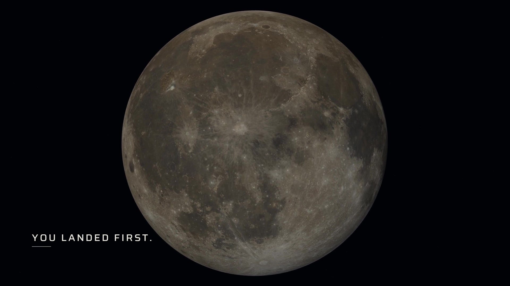
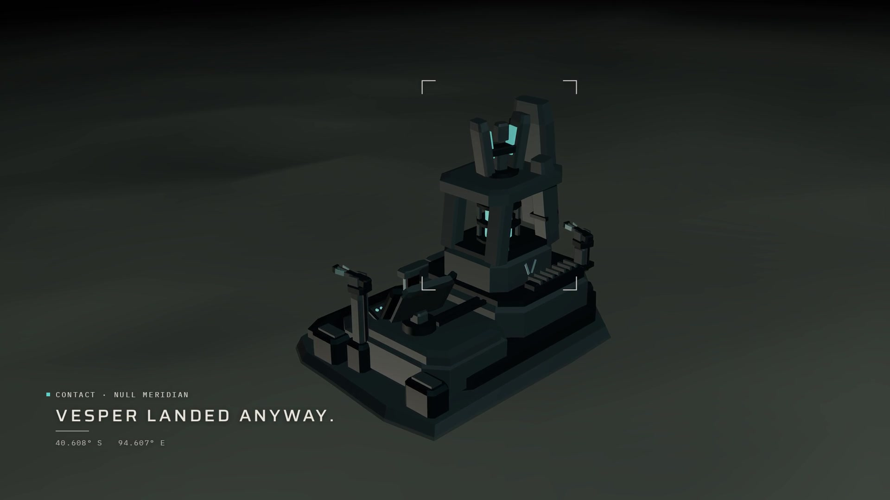
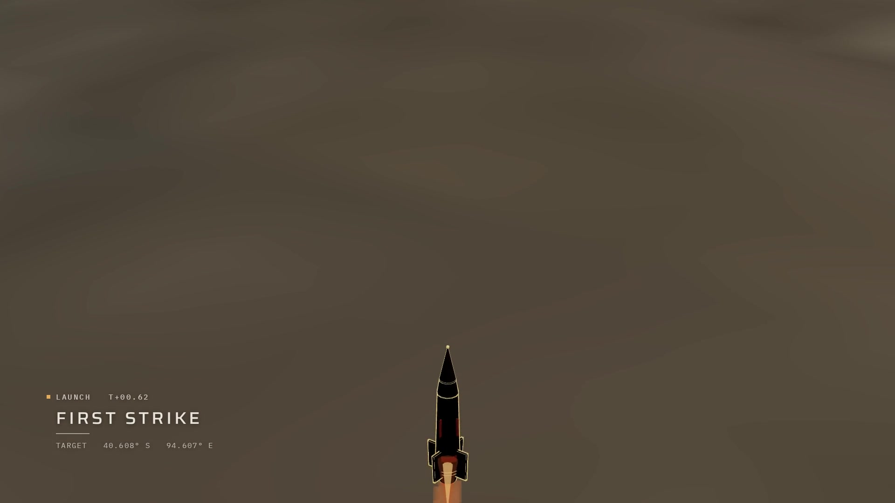
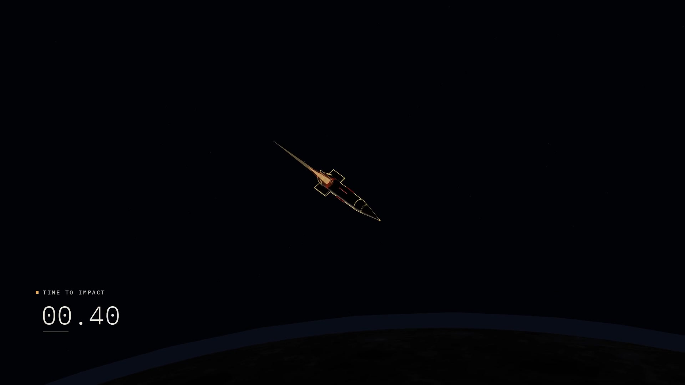
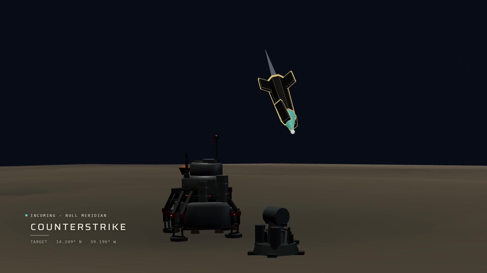
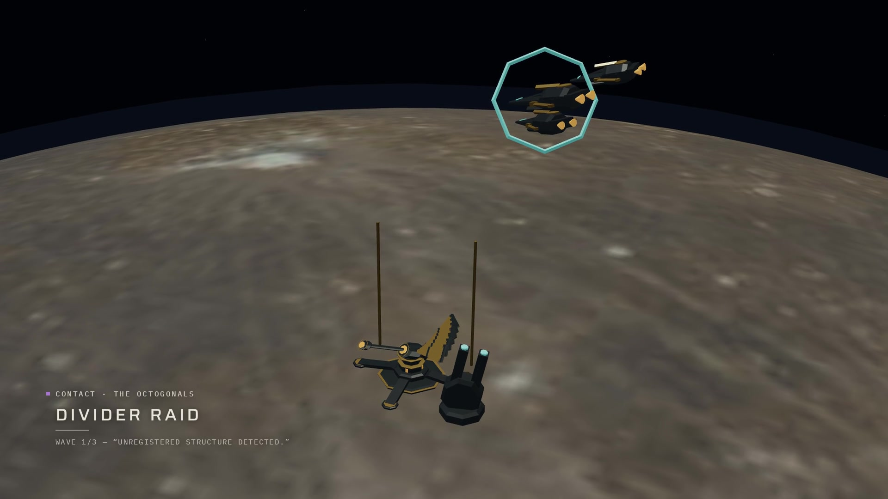
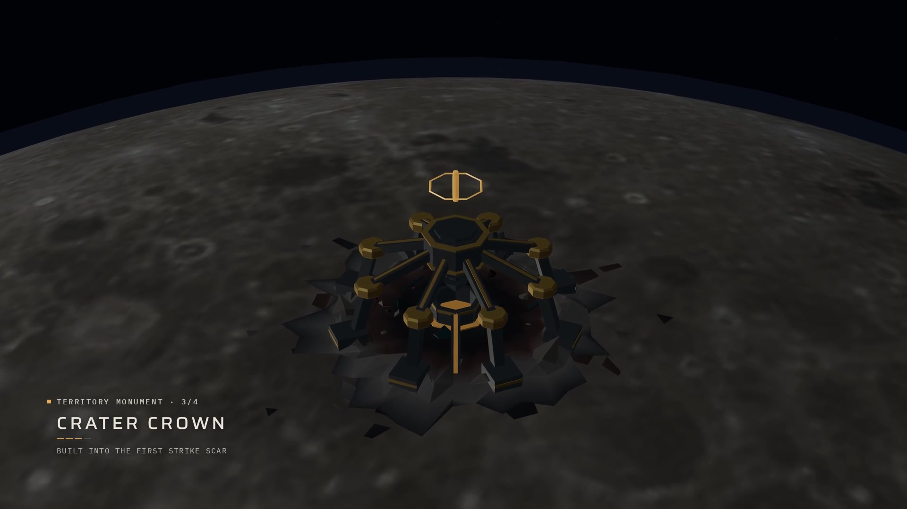
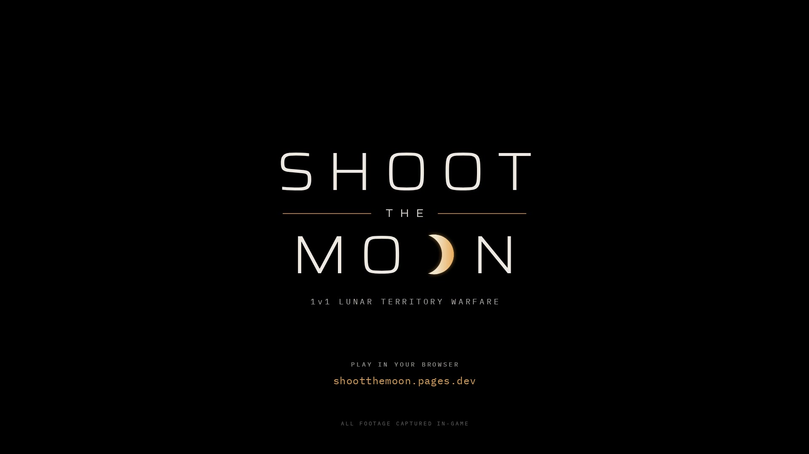

# Shoot the Moon — reel motion graphics treatment

**Concept: ORBITAL RECORD** (the name is the game's own: its HUD reads SCARRED MOON · ORBITAL
RECORD after the first strike). The reel is the Moon's record of the campaign: who arrived, who
fired, where it landed, what was built. The graphics are written in the voice of a flight
record, quiet and exact. The game's UI stays the voice of the commanders.

Two rules decide every call below:

1. **Graphics announce. Footage delivers.** Type sets up a moment and clears out before it
   happens. Nothing is ever on screen during an impact, flash or dip.
2. **Every number is true.** Each coordinate, clock and count on screen comes from the game's
   own data for the shot it sits on (provenance table in §9). No decorative numbers.

| | |
|---|---|
| Reel | `public/media/shoot-the-moon/reel-57s-1080.mp4` — 1920×1080, 60 fps, 3,456 frames, 57.6 s, no audio |
| Locked edit | `mataindustries/shootthemoon` → `capture/finalEdit.json` (25 clips + end card, 100 BPM, 24 bars), assembled by `capture/ci/assembly.ts` with the run #6 release overrides |
| Deliverables here | this document · `reel-titles.cues.json` (frame-exact cue sheet, source of truth) · `style-frames/` (8 frames from the verified preview) · `prototype/` (reference renderer) |
| Notation | `f` = reel frame at 60 fps (f / 60 = seconds). Bar = 144 f (2.4 s), beat = 36 f (0.6 s), edit grid = 18 f (0.3 s), motion unit = 9 f |

A full-length review preview was rendered from this exact cue sheet and checked frame by frame
against the current reel: only the declared frames change (no other frame differs by more than
0.32 luma levels at 64×36), and every flash, dip and fade is untouched.

---

## 1. Diagnosis

**What already works.** Every cut sits on the edit's 300 ms grid: the reel is cut to 100 BPM,
24 bars, before any music exists, so it is ready for a score. The hero orbital shot (14.4 s),
both impacts, the Crater Crown payoff and the Bastion pull-back are strong in-engine images. The
game's own UI cards (Vesper's transmission, the launch authority dialog, FIRE NOW, the Signal
Array status card) are legible and well written.

**What hurts it.**

1. **Six seconds of frozen frames at 7.2–13.2 s.** The Citadel hold (c03), the transmission hold
   (c04) and the launch dialog still (c05) are consecutive. The reel stops moving exactly when
   the antagonist enters. Static stretches return at 27.0–30.0 s (two stills either side of a
   fade) and 34.8–36.0 s.
2. **No premise for the first twelve seconds.** A Moon, a lander, a fortress. Nothing tells a
   viewer that this is a race for one Moon until Vesper's card at 9.6 s.
3. **Features fly by unnamed.** Four distinct territory monuments, a third faction and a
   counterstrike read as "more structures" and "more ships".
4. **The end card breaks the reel's promise.** Every frame is in-game except the last 4.8 s: an
   illustrated key art with a photoreal Moon, an asteroid field and a lens flare that the game
   does not have, with the title baked in, so it cannot be timed to the final chord.
5. **One footage defect (not motion graphics).** The FIRST STRIKE COMPLETE still (27.0 s) has the
   title screen bleeding through the card (§8).

---

## 2. The eight moments

Ranked by how much each raises perceived production quality. Everything else in the reel stays
clean.

| # | When | Moment | What it fixes |
|---|---|---|---|
| 1 | 52.80–57.60 | **End card** — typographic lockup on black, the crescent "O" waxes on the final chord | The last impression; replaces the off-style illustration |
| 2 | 7.20–9.58 | **Rival contact** — brackets lock on the Citadel's command tower, "VESPER LANDED ANYWAY." + slow push on the held frames through 13.2 s | The six-second freeze; introduces the antagonist |
| 3 | 19.20–21.48 | **Time to impact** — a countdown that reaches 00.00 six frames before the white flash | The darkest, emptiest shot gets a clock; the flash becomes its payoff |
| 4 | 0.60–2.38 | **Cold open** — "YOU LANDED FIRST." | Gives the opening a premise in three words |
| 5 | 40.80–47.38 | **Monument roll-call** — 1/4 → 4/4, one name per cut | Turns the montage into a feature list without marketing copy |
| 6 | 13.20–14.40 | **Launch record** — FIRST STRIKE + running T+ clock | Fills the murky liftoff with the reel's mission-control signature |
| 7 | 33.60–36.00 | **DIVIDER contact** — "THE OCTOGONALS", their own radio line | Introduces the third faction; animates over a frozen cover |
| 8 | 30.00–31.08 | **Counterstrike mirror** — same layout as the launch, colour and target reversed | Makes the reversal legible as a rhyme |

On-screen time: 22.5 s of graphics in 57.6 s (17.7 s before the end card), in eight separate
windows, none during an impact. The longest clean passages are 14.4–19.2 (the orbital flight),
21.5–30.0 (impact through the reversal) and 47.4–52.8 (the pull-back).

### Style frames

Taken from the full-length preview rendered from `reel-titles.cues.json` (plate pushes included).

| | |
|---|---|
|  **f100 · 1.67 s** cold open |  **f530 · 8.83 s** rival contact |
|  **f850 · 14.17 s** launch record |  **f1230 · 20.50 s** time to impact |
|  **f1845 · 30.75 s** counterstrike |  **f2120 · 35.33 s** DIVIDER contact (held frame, pushed) |
|  **f2680 · 44.67 s** monument roll-call 3/4 |  **f3455 · 57.58 s** end card, final frame |

---

## 3. Shot-by-shot audit

Clip ids refer to `capture/finalEdit.json`. "Hold" and "cover" are the run #6 release interval
overrides in `capture/ci/assembly.ts`.

### 01 · 0.00–4.80 · f0–287 · c01 descent approach
- **Viewer sees:** the full Moon emerging from black (1.2 s head fade), a slow in-engine approach
  with a 1.2× push; by 4.5 s the Moon fills the frame.
- **Strength / problem:** a confident first image, but for 4.8 s nothing says what game this is
  or what is at stake.
- **Treatment:** E1. One line in the record position (lower left), in the black beside the Moon.
  A 72 px rule draws under it.
- **Copy:** `YOU LANDED FIRST.`
- **Entrance:** f36 (0.60 s, beat 2): opacity 0→1 over 9 f while letter-spacing closes
  0.24→0.16 em over 18 f. Rule draws left→right f45–53.
- **Exit:** opacity 1→0 over f135–143; gone at 2.38 s, before the Moon's limb reaches the text.
- **Duration:** 1.78 s on screen, 1.5 s at full opacity.
- **Why:** the game's own opening line (LaunchGate) turns an establishing shot into a premise.
  Bar 2 then plays clean, so the touchdown at 4.8 s lands as the answer.

### 02 · 4.80–7.20 · f288–431 · c02 touchdown
- **Viewer sees:** the capsule settling as the orange touchdown ring blooms from a 2× punch-in;
  dips to black over the last 0.3 s.
- **Strength:** the first percussive beat and the first look at player hardware. The ring is
  already a graphic.
- **Treatment:** none.
- **Why:** an added element would compete with the ring, and a clean beat between the two
  narrative lines lets each land.

### 03 · 7.20–9.60 · f432–575 · c03 Vesper Citadel (hold)
- **Viewer sees:** Null Meridian's Citadel on the night side, cyan-lit: one held frame for 2.4 s
  (the live footage flickered).
- **Problem:** first of six motionless seconds, exactly as the antagonist enters.
- **Treatment:** plate push **P1** (1.000→1.040, linear, about frame centre) + **E2** discovery:
  four corner brackets lock on the command tower; record block with a cyan faction chip.
- **Copy:** kicker `CONTACT · NULL MERIDIAN` · primary `VESPER LANDED ANYWAY.` · data
  `40.608° S   94.607° E`
- **Entrance:** f432, on the cut: brackets contract from 108 % to 100 % of the tower box while
  fading to 82 % over 18 f. f450: chip + kicker (9 f). f468: primary (9 f fade, 18 f tracking
  settle) and rule draw. f486: data (9 f).
- **Exit:** everything fades over f567–575 and is gone at the 9.60 s cut, where the game's own
  transmission card takes the same lower-left position.
- **Duration:** 2.38 s; the sentence is fully readable for 1.5 s.
- **Why:** the frozen frame becomes a discovery beat (brackets, type and a slow push all move),
  and the second half of the premise lands on the rival reveal. The coordinates start the
  telemetry thread that pays off at launch and at the counterstrike.

### 04 · 9.60–12.00 · f576–719 · c04 Vesper transmission (hold)
- **Viewer sees:** the Citadel with the game HUD: INCOMING TRANSMISSION · COMMANDER VESPER —
  "First is not ownership. Remove your extractor from my Moon." [IGNORE HER].
- **Strength / problem:** the game's best line, legible. Frozen.
- **Treatment:** plate push **P2** (1.000→1.020). No added text.
- **Why:** the game is speaking; only keep the picture alive. At 1.02 the corners move about 19 px, so
  the HUD card stays fully inside frame.

### 05 · 12.00–13.20 · f720–791 · c05 launch authority dialog (still)
- **Viewer sees:** FINAL COMMAND AUTHORITY · LAUNCH AT NULL MERIDIAN? [CANCEL] [FIRE].
- **Strength / problem:** the player's decision in real UI. Static.
- **Treatment:** plate push **P3** (1.000→1.012). No text.
- **Why:** the dialog is the copy. The push finishes the six-second stretch in motion.

### 06 · 13.20–14.40 · f792–863 · c06 liftoff
- **Viewer sees:** a flat brown frame; the warhead's nose enters bottom centre, exhaust flaring,
  as the crop tilts up.
- **Problem:** the first half reads as empty ground; the launch has no ceremony.
- **Treatment:** **E3** launch record, amber chip. Chapter mark plus a running clock.
- **Copy:** kicker `LAUNCH   T+00.00` (counts to `T+00.76`) · primary `FIRST STRIKE` · data
  `TARGET   40.608° S   94.607° E`
- **Entrance:** f792, on the cut: chip, kicker and rule. f801: primary. f810: data.
- **Exit:** hard cut with the picture at f864 (14.40 s).
- **Duration:** 1.2 s.
- **Why:** the most mission-control element in the system arrives with the launch roar and names
  the chapter. The target is the coordinate seen at 8.1 s. The clock is game time (0.768 s over a
  1.2 s shot), so it visibly runs slow: honest slow motion.

### 07 · 14.40–16.80 · f864–1007 · c07 orbital flight (hero, poster frame)
- **Viewer sees:** the warhead crossing the lit limb in 0.17× real-frame slow motion; the right
  half is black lead room.
- **Treatment:** none.
- **Why:** the reel's best image, where the full groove opens. E3's hard exit makes the clean
  frame feel like a reveal.

### 08 · 16.80–19.20 · f1008–1151 · c08 second angle
- **Viewer sees:** the warhead turning nose-down along the limb.
- **Treatment:** none.
- **Why:** with 07 this is 4.8 s of uninterrupted spectacle, the longest in the reel.

### 09 · 19.20–21.60 · f1152–1295 · c09 terminal approach → white flash
- **Viewer sees:** a small warhead over a dark limb in a mostly black frame (mean luma ≈ 18/255);
  the last 0.6 s is the cue map's silence; ends in a 200 ms white flash.
- **Problem:** the lowest-information shot in the reel, and its tension depends on music that
  does not exist yet.
- **Treatment:** **E4** countdown, the only large number in the reel.
- **Copy:** kicker `TIME TO IMPACT` · digits `00.99` → `00.00`
- **Entrance:** f1152, on the cut: chip, kicker, rule. f1161: digits (9 f).
- **Silence beat:** at f1260 (21.00 s, the cue map's silence drop) chip, kicker and rule fade over
  9 f; the digits stay alone.
- **Exit:** digits read `00.00` from f1284 and disappear at f1290, the first frame of the flash.
- **Duration:** 2.3 s.
- **Why:** a dark, quiet shot gets a clock to watch, and the white flash becomes the payoff the
  countdown promised. Without music, the numbers are the riser.

### 10 · 21.60–24.00 · f1296–1439 · c10 impact dome
- **Viewer sees:** the flash resolving into an amber dome over a jagged crater.
- **Treatment:** none (destruction rule).
- **Why:** the countdown did the announcing; the footage delivers.

### 11 · 24.00–27.00 · f1440–1619 · c11 ejecta
- **Viewer sees:** debris plume and shock ring, the crater darkening.
- **Problem:** gets dark; 3 s is long without music.
- **Treatment:** none.
- **Why:** it is the breath after the hit, and the next shot names the outcome in the game's
  words. A label here would pre-empt THE MOON REMEMBERS.

### 12 · 27.00–28.80 · f1620–1727 · c12 FIRST STRIKE COMPLETE (still, fades to black)
- **Viewer sees:** NULL MERIDIAN · SIGNAL LOST / FIRST STRIKE COMPLETE / THE MOON REMEMBERS /
  "Null Meridian's foothold is gone. Its scar remains."
- **Problem:** static, and the title screen ghosts through the translucent card (§8).
- **Treatment:** plate push **P4** (1.000→1.015, through the fade). No text.
- **Why:** the card closes the chapter in the game's own words; reel text would double it.

### 13 · 28.80–30.00 · f1728–1799 · c13 FIRE NOW (still) + c14 cover
- **Viewer sees:** ORBITAL INTERCEPT · VESPER COUNTERSTRIKE · INTERCEPT ACTIVE, the FIRE NOW
  panel, an amber reticle on the Moon; one frame held for 1.2 s.
- **Strength / problem:** the reversal in real UI on the bar-13 downbeat. Static.
- **Treatment:** plate push **P5** (1.000→1.015). No text.
- **Why:** already the loudest UI in the reel. It needs life, not labels.

### 14 · 30.00–31.20 · f1800–1871 · c15 terminal dive → white flash
- **Viewer sees:** a cyan-exhaust warhead falling onto the player's lander.
- **Treatment:** **E5** counterstrike record, cyan chip: a mirror of E3.
- **Copy:** kicker `INCOMING · NULL MERIDIAN` · primary `COUNTERSTRIKE` · data
  `TARGET   14.209° N   39.190° W`
- **Entrance:** f1800 on the cut; primary f1809; data f1818.
- **Exit:** fades over f1857–1865, gone one frame before the flash (f1866).
- **Duration:** 1.08 s.
- **Why:** same layout as the launch; the chip turns amber→cyan, the verb LAUNCH→INCOMING, and
  the target is now your own coordinates. One word names the chapter.

### 15 · 31.20–33.60 · f1872–2015 · c16 impact contact
- **Viewer sees:** white core, shock ring and debris beside the lander.
- **Treatment:** none (destruction rule).

### 16 · 33.60–36.00 · f2016–2159 · c17 DIVIDER formation + c18 cover
- **Viewer sees:** octogonal craft locked in the game's cyan reticle above the Signal Array under
  construction; from 34.8 s one frame held for 1.2 s.
- **Problem:** a third faction with no introduction, then a freeze.
- **Treatment:** plate push **P6** (1.000→1.020) on the held half + **E6** discovery record,
  violet chip. No brackets: the game's reticle already frames the target.
- **Copy:** kicker `CONTACT · THE OCTOGONALS` · primary `DIVIDER RAID` · data
  `WAVE 1/3 — “UNREGISTERED STRUCTURE DETECTED.”`
- **Entrance:** f2016 (bar 15 downbeat); primary f2025; data f2034.
- **Exit:** hard cut with the picture at f2160 (36.00 s, the escalation downbeat).
- **Duration:** 2.4 s.
- **Why:** in two lines the viewer learns there is a third party, who they are, and their tone
  (their own bureaucratic radio line). The frozen half has something moving over it.

### 17 · 36.00–39.00 · f2160–2339 · c19 volley + c20 defense beam
- **Viewer sees:** violet fire from the octogonals; the cyan beam breaking the lead.
- **Treatment:** none.
- **Why:** the fight is clear and should be the star.

### 18 · 39.00–40.80 · f2340–2447 · c21 Signal Array status card
- **Viewer sees:** a push into the real card: HULL 100% · 3/3 WAVES · TERRITORY CLAIMED ·
  PERMANENT · "Nobody lands unannounced again."
- **Treatment:** none. The shot already moves and is already a title card made of real UI.

### 19 · 40.80–45.60 · f2448–2735 · c22–c24 monument montage
- **Viewer sees:** Helios Spire firing its mass driver (1.8 s), the Signal Array's vanes (1.2 s),
  the Crater Crown seated in the First Strike scar (1.8 s); the cut rate accelerates.
- **Problem:** four buildable monuments, a headline feature, pass unnamed.
- **Treatment:** **E7** roll-call, amber chip. One name per cut and a four-segment rule that
  lights one segment per monument.
- **Copy:** kicker `TERRITORY MONUMENT · 1/4` (→ 2/4, 3/4, 4/4) · primaries `HELIOS SPIRE`,
  `SIGNAL ARRAY`, `CRATER CROWN`, `BASTION ZIGGURAT` · data `FUSION REACTOR + LUNAR MASS
  DRIVER`, `+50% RIVAL SCAN SPEED`, `BUILT INTO THE FIRST STRIKE SCAR`, `EVERY STEP A WALL`
- **Entrance:** block in at f2448 (bar 18; primary f2457, data f2466). On each picture cut
  (f2556, f2628, f2736) the name, index and data swap hard, the new name gets a 9 f tracking
  settle (0.20→0.16 em) and the next rule segment draws over 9 f.
- **Exit:** fades over f2835–2843 (gone at 47.38 s), three beats into c25.
- **Duration:** 6.58 s across four shots.
- **Why:** the counter says "there are four", the names give them identity, and the data lines
  are the game's own copy. The swaps are the "one hit per cut" the cue map asks for.

### 20 · 45.60–52.80 · f2736–3167 · c25 Bastion pull-back → dip to black
- **Viewer sees:** the Bastion Ziggurat and its amber claim beacon, pulling back in one move to
  the whole lit Moon; dips to black from 52.2 s.
- **Strength:** the resolution, one real camera move; the claim stays readable from orbit.
- **Treatment:** E7's 4/4 entry for the first 1.8 s, then nothing.
- **Why:** 5.4 s of clean pull-back is the emotional landing. The claim is shown, not written.

### 21 · 52.80–57.60 · f3168–3455 · end card
- **Currently:** a dip from black into the illustrated key art, title baked in, static for 4.2 s.
- **Problem:** the only non-game image, shown last; promises things the game does not have; the
  title cannot be timed.
- **Treatment:** **E8**, a typographic end card on black in the reel's own type system (§4.7).
- **Copy:** `SHOOT` / `THE` / `MOON` (crescent O) · `1v1 LUNAR TERRITORY WARFARE` ·
  `PLAY IN YOUR BROWSER` · `shootthemoon.pages.dev` · `ALL FOOTAGE CAPTURED IN-GAME`
- **Entrance:** a one-bar build from f3168 (§4.7).
- **Exit:** none. The final frame is the complete lockup, which matters because the site's
  player rests on the last frame when playback ends.
- **Duration:** 4.8 s, the last 1.8 s fully static.
- **Why:** it ends on the brand in the same restrained voice as everything before it, with one
  flourish in the whole piece: the Moon in the logotype waxing on the final chord. The key art
  keeps its proper job as poster and capsule art.

---

## 4. Systems

### 4.1 Opening 3–5 seconds

| Time | Frames | Picture | Graphics |
|---|---|---|---|
| 0.00–0.60 | f0–35 | black → Moon fading in | nothing |
| 0.60 | f36 | Moon at ~50 % brightness | `YOU LANDED FIRST.` settles in, lower left, in the black beside the Moon |
| 0.75 | f45 | | 72 px rule draws under it |
| 0.75–2.25 | | fade-in completes, slow push | holds at full opacity (1.5 s) |
| 2.25–2.38 | f135–143 | | fades out before the limb reaches the text |
| 2.40–4.80 | bar 2 | the Moon swells to fill frame | nothing |
| 4.80 | bar 3 | hard cut: touchdown | nothing |

No logo, no title, no studio card. Premise first, brand last. Bar 1 is the statement, bar 2 the
image, bar 3 the first hit.

### 4.2 Typography

Two families, both SIL OFL (`google/fonts`): **Saira** (variable: `wdth`, `wght`) for words that
are read, **IBM Plex Mono** for data. Saira's squared-oval forms match the approved key-art
wordmark, so chapter titles and the end-card logotype read as one family; at width 110 it stays
technical without turning into display sci-fi. Plex Mono is a true monospace, so counters never
jitter, and it carries the engineering-document tone.

| Role | Face | Size @1080p | Tracking | Case | Colour |
|---|---|---|---|---|---|
| Primary (chapter / narrative line) | Saira wdth 110 wght 500 | 36 px | 0.16 em (enters at 0.24) | UPPER | ink 96 % |
| Kicker | Plex Mono 500 | 16 px | 0.16 em | UPPER | ink 76 % |
| Data | Plex Mono 400 | 16 px | 0.08 em | UPPER | ink 66 % |
| Countdown digits | Plex Mono 300 | 72 px | 0.02 em | — | ink 96 % |
| Wordmark (SHOOT, MOON) | Saira wdth 125 wght 300 | 128 px | 0.20 em (enters at 0.30) | UPPER | ink 100 % |
| Wordmark THE | Saira wdth 125 wght 400 | 26 px | 0.62 em | UPPER | ink 92 % |
| Tagline | Plex Mono 400 | 19 px | 0.30 em | as written | ink 74 % |
| Call to action | Plex Mono 500 | 15 px | 0.26 em | UPPER | ink 62 % |
| URL | Plex Mono 400 | 24 px | 0.06 em | lower | amber 94 % |
| Footer | Plex Mono 400 | 13 px | 0.22 em | UPPER | ink 42 % |

- **Colour:** ink `#EDE8DF` (warm lunar white, never pure white). Accents are the game's own
  palette from `src/render/visualSystem.ts`: amber `#EFAD58` (monumentAmber, the player),
  cyan `#55C5CC` (rivalCyanEmissive, Null Meridian), violet `#AA7ED8` (octogonalViolet, the
  Octogonals). Accents appear only as 8 px chips, the monument rule, the URL and the crescent.
- **Legibility:** record text carries a soft shadow (0 0 1 px rgba(0,0,0,.55) + 0 1 px 12 px
  rgba(0,0,0,.45)). No glow anywhere except the crescent rim.
- **Reading time at full opacity:** ≥ 0.6 s for one word, ≥ 0.9 s for two, ≥ 1.5 s for a sentence.
- **Density:** one block on screen at a time, three lines maximum.
- **Small screens:** at full-screen landscape on a phone (~0.44×) primaries render at ~16 px and
  read; kicker and data lines become texture, by design. The story lives in the primaries.

### 4.3 Telemetry / HUD language

The record block is the only HUD element. It never persists: no running timecode, frame borders,
corner marks, grids or scanlines.

```
 ■ KICKER · SOURCE                 ← 8 px faction chip hangs in the margin (x 100); kicker baseline y 858
 PRIMARY LINE                      ← x 120, baseline y 910
 ────────                          ← rule 72 × 2 px at y 930 (top edge)
 DATA LINE                         ← baseline y 962
```

- **Anchor:** every entry sits at x 120 with fixed baselines per role. A missing role leaves
  its slot empty and nothing shifts. The block's bottom is 114 px above the frame edge, clear of
  native player controls.
- **Elements allowed:** the record block; the 72 px rule; the four-segment rule (E7); faction
  chips; corner brackets (2 px stroke, 28 px arms) for discoveries the game does not frame
  itself; countdown digits.
- **Faction code:** amber = you, cyan = Null Meridian, violet = the Octogonals.
- **Formats:** coordinates exactly as the game prints them (`14.209° N`, three decimals, three
  spaces between latitude and longitude); clocks `SS.hh`, floored to hundredths; counts `1/3`.
- **Never:** boxes or panels, fills behind text, glitch, chromatic aberration, noise, scan or
  radar sweeps, rotating rings, hexagons or octagons (octagons are the game's own reticle and
  beacon language), crosshairs, typewriter or decode effects, any agency name or mark. The
  Moon textures are NASA SVS; their terms forbid implying endorsement.

### 4.4 Feature and chapter labels

Two kinds of primary line:

- **Narrative lines** are sentences with a full stop, always the game's own words:
  `YOU LANDED FIRST.` (0.6 s), `VESPER LANDED ANYWAY.` (7.8 s).
- **Chapter titles** have no full stop: `FIRST STRIKE` (13.2 s), `COUNTERSTRIKE` (30.0 s),
  `DIVIDER RAID` (33.6 s), then the feature roll-call `TERRITORY MONUMENT 1/4–4/4` (40.8–47.4 s).

Kicker verbs are fixed: `CONTACT` (a discovery), `LAUNCH` (you attack), `INCOMING` (you are
attacked), `TIME TO IMPACT` (the countdown), `TERRITORY MONUMENT` (a feature).

Never label a moment the game's UI already labels (c04, c05, c12, c13, c21). Never put text
over an impact.

### 4.5 Transition language

- **The edit's transitions stay exactly as locked:** cuts on the 300 ms grid, two 200 ms white
  flashes, two dips to black, one fade to black. The graphics add no transitions.
- **Entrances:** *settle* (opacity 0→1 over 9 f plus letter-spacing closing 0.24→0.16 em over
  18 f), *draw* (rules grow from their origin over 9 f, hairlines over 27 f), *contract*
  (brackets close from 108 % over 18 f). Ease `cubic-bezier(0.22, 1, 0.36, 1)`.
- **Exits:** *cut with the picture* when an entry ends on a cut (E3, E6), or *fade clear*: a
  9 f fade that ends before the next flash, dip or cut (E2, E5), or mid-shot so the picture
  continues alone (E1, E7). No movement on exit.
- **Swaps:** hard, on the picture cut, with a 9 f tracking settle on the new word (E7).
- **Stagger:** chip/kicker/rule → primary +9 f → data +18 f.
- **Plate pushes** are the invisible support transition: frozen holds get a linear push of at
  most 4 %, so no frame in the reel is perfectly still before the end card.
- **Banned:** slides from off-screen, scale pops, blur or whip transitions, light leaks, glitch
  cuts, any transition used only for the sake of moving.

### 4.6 Impact treatments

| Event | Treatment | Instances |
|---|---|---|
| **Launch** | Record entry on the ignition cut: amber chip, `LAUNCH T+` clock in game time, chapter title, target coordinates. Hard exit on the next cut. | E3 |
| **Attack** | A countdown in game time that reaches `00.00` six frames before the flash; at the silence the labels fall away and the digits stand alone. Used once, so it stays special. The counterattack gets a record entry, not a second countdown. | E4 (E5) |
| **Discovery** | `CONTACT` kicker + faction chip + the faction's own words. Corner brackets lock on the subject only when the game does not already frame it. | E2, E6 |
| **Destruction** | Nothing. No shake, no added flash, no "IMPACT CONFIRMED" stamp. Graphics clear before every flash and stay off for at least one beat after it; the soonest return is E6, 2.4 s after the counterstrike flash. | c10, c11, c16 |

### 4.7 End card

Plate: black (the end-card slot assembled without `--end-card`; the dip from c25 already lands on
black). Lockup centred on x 960:

| Element | Spec | Baseline y |
|---|---|---|
| `SHOOT` | wordmark style | 452 |
| `THE` + two hairlines | wordmarkThe; hairlines amber 72 %, 210 × 2 px, 34 px from the word, top edge y 507 | 516 |
| `MOON` | wordmark style; the second O is not drawn and is replaced by the crescent | 650 |
| Crescent | circle D = 1.06 × cap height (cap = 0.70 × 128 px), centred on the hidden O, shifted left 0.10 D for optical balance; lit area = circle minus an equal occluder offset −0.30 D (waxing, lit on the right); fill `#F3E6CC`→amber at the rim; amber rim glow σ 5 px, 55 % | — |
| `1v1 LUNAR TERRITORY WARFARE` | tagline style (kept verbatim from the approved key art) | 724 |
| `PLAY IN YOUR BROWSER` | call-to-action style | 872 |
| `shootthemoon.pages.dev` | URL style, amber | 914 |
| `ALL FOOTAGE CAPTURED IN-GAME` | footer style | 1012 |

Choreography (bar 23 = f3168–3311, bar 24 = f3312–3455):

| Frame | Time | Beat | Action |
|---|---|---|---|
| f3168 | 52.80 | 23.1 | `SHOOT` and `MO N` fade in over 36 f; tracking closes 0.30→0.20 em over 54 f. The O slot is empty: a new moon. |
| f3204 | 53.40 | 23.2 | `THE` fades in (18 f, tracking 0.80→0.62 over 27 f); hairlines draw outward from the word (27 f) |
| f3240 | 54.00 | 23.3 | **The crescent waxes**: occluder slides 0 → −0.30 D over 36 f (ease in-out), rim glow rises with it |
| f3276 | 54.60 | 23.4 | tagline fades in (18 f) |
| f3312 | 55.20 | 24.1 | `PLAY IN YOUR BROWSER` + URL fade in (18 f) |
| f3330 | 55.50 | | footer fades in (18 f) |
| f3348–3455 | 55.80–57.58 | | static hold, 1.8 s. Last frame = complete lockup. No fade-out. |

**Fallback, if the illustrated key art must stay:** keep `--end-card`, drop E8 entirely and add
nothing on top. Never add a second title over the baked one.

### 4.8 Visual rhythm, ready for music

The edit is already locked to **100 BPM, 4/4, 24 bars**; the graphics sit on the same grid and on
the cue map in `finalEdit.json`, so a score written to that cue map needs no retiming.

| Frame | Time | Bar.beat | Graphic hit | Cue map |
|---|---|---|---|---|
| f36 | 0.60 | 1.2 | E1 settles in | drone-swell |
| f432 | 7.20 | 4.1 | E2 brackets lock | vesper-sting |
| f468 | 7.80 | 4.2 | "VESPER LANDED ANYWAY." | |
| f792 | 13.20 | 6.3 | E3 launch record | launch-roar |
| f1152 | 19.20 | 9.1 | E4 countdown starts | descent-riser |
| f1260 | 21.00 | 9.4 | labels fall away, digits alone | silence-drop |
| f1290 | 21.50 | | digits vanish into the flash | first-strike-impact (21.6) |
| f1800 | 30.00 | 13.3 | E5 counterstrike record | incoming-roar |
| f2016 | 33.60 | 15.1 | E6 DIVIDER contact | divider-raid |
| f2448 / 2556 / 2628 / 2736 | 40.8 / 42.6 / 43.8 / 45.6 | 18.1 / 18.4 / 19.2 / 20.1 | E7 swaps, one per cut | montage-helios / -signal / -crown / resolution |
| f3168 | 52.80 | 23.1 | E8 wordmark | final-chord |
| f3240 | 54.00 | 23.3 | crescent waxes | |
| f3312 | 55.20 | 24.1 | URL | |

Rules for the composer and editor: every graphic event starts on the 18-frame grid; internal
staggers are 9-frame multiples (sixteenth notes); an exit ends on a cut or one frame before a
flash or dip. Density follows the acts: two quiet lines in the first 12 s, three fast entries
through the strikes, a steady roll-call in the montage, then silence until the title.

---

## 5. Plate pushes (support treatment)

Every frozen interval gets a slow, linear push about frame centre. Scale is a function of the reel
frame: `s(f) = s0 + (s1 − s0)·(f − from)/(to − from)`.

| Id | Frames | Time | Clip | Scale |
|---|---|---|---|---|
| P1 | f432–575 | 7.20–9.58 | c03 hold (Citadel) | 1.000 → 1.040 |
| P2 | f576–719 | 9.60–11.98 | c04 hold (transmission) | 1.000 → 1.020 |
| P3 | f720–791 | 12.00–13.18 | c05 still (launch dialog) | 1.000 → 1.012 |
| P4 | f1620–1727 | 27.00–28.78 | c12 still incl. its fade | 1.000 → 1.015 |
| P5 | f1728–1799 | 28.80–29.98 | c13 still + c14 cover | 1.000 → 1.015 |
| P6 | f2088–2159 | 34.80–35.98 | c18 cover (held c17#71) | 1.000 → 1.020 |

They must be sub-pixel smooth. In the preview, ffmpeg `zoompan` (even on a 4× upscale) produced
a visible step every 3–4 frames; the `perspective` method in §10 (item 8) produced uniform
motion and is the one to use.

---

## 6. Copy deck

Every string that appears, in order. Proofread here, change only in the cue sheet.

```
YOU LANDED FIRST.
CONTACT · NULL MERIDIAN / VESPER LANDED ANYWAY. / 40.608° S   94.607° E
LAUNCH   T+00.00 / FIRST STRIKE / TARGET   40.608° S   94.607° E
TIME TO IMPACT / 00.99
INCOMING · NULL MERIDIAN / COUNTERSTRIKE / TARGET   14.209° N   39.190° W
CONTACT · THE OCTOGONALS / DIVIDER RAID / WAVE 1/3 — “UNREGISTERED STRUCTURE DETECTED.”
TERRITORY MONUMENT · 1/4 / HELIOS SPIRE / FUSION REACTOR + LUNAR MASS DRIVER
TERRITORY MONUMENT · 2/4 / SIGNAL ARRAY / +50% RIVAL SCAN SPEED
TERRITORY MONUMENT · 3/4 / CRATER CROWN / BUILT INTO THE FIRST STRIKE SCAR
TERRITORY MONUMENT · 4/4 / BASTION ZIGGURAT / EVERY STEP A WALL
SHOOT / THE / MOON / 1v1 LUNAR TERRITORY WARFARE / PLAY IN YOUR BROWSER / shootthemoon.pages.dev / ALL FOOTAGE CAPTURED IN-GAME
```

---

## 7. What stays untouched

The locked timeline, every clip and source window, every cut, the head fade, both white flashes,
both dips, the fade to black, the 3,456-frame length, the poster, the stills, and the silent
13.8 s loop (which must stay textless; `finalEdit.json` says "No HUD, no text").

---

## 8. Footage note (the one change I recommend outside motion graphics)

**c12 FIRST STRIKE COMPLETE (27.0–28.8 s) shows the title screen through the card.** At 1080p you
can read a ghosted "SHOOT THE MOON", "FIRST STRIKE", "You landed first. Vesper landed anyway.
Neither intends to share." and a "CONTINUE" button behind the translucent card, for 1.8 s at the
centre of frame. Cause: `dismissLaunchGate` (`capture/initCapture.ts`) waits for
`data-entry-open="false"` but not for `.launch-gate--closing` to finish its CSS opacity
transition, and this shot is a real-time screenshot, so it caught the gate mid-fade. Fix: before
`captureStill`, wait until `.launch-gate` is gone or its computed opacity is `0` (or capture with
`prefers-reduced-motion: reduce`, which drops that transition to 1 ms in `src/styles.css`), then
re-render c12 only and re-pin it. No graphic can hide this without covering the card, so none is
proposed.

Optional, later: if the Citadel flicker behind the c03/c04 holds is ever fixed, live footage beats
any push. E2 stays as designed; P1/P2 would be dropped.

---

## 9. Provenance of every number

| On screen | Value | Source |
|---|---|---|
| Player base | 14.209° N 39.190° W (+18 m) | `FIXTURE_SITE = createLandingSite(createLunarLocation(0.248, -0.684, 18))`, `e2e/rivalFixtures.ts`, used by the READY/STRUCK/CLAIM capture fixtures behind c06, c15–c16 and the monuments |
| Null Meridian site | 40.608° S 94.607° E | `deriveRivalSite(FIXTURE_SITE)`, `src/domain/rival.ts` (132° of arc from the player, about 4,003 km on the 1,737.4 km mean sphere) |
| Coordinate format | `14.209° N` | `formatCoordinate`, `src/app/CinematicHud.tsx` |
| `T+00.00 → 00.76` | 0 → 768 ms | c06 samples `first-strike:launch` progress 0–0.24 of 3,200 ms |
| `00.99 → 00.00` | 990 → 0 ms | c09 samples `first-strike:target-approach` 0.55–1.0 of 2,200 ms. The display reaches zero at f1284 so zero is seen before the flash; that compresses the last 76 ms of game time into the final six frames |
| `WAVE 1/3` | first of three waves | `OCTOGONALS.waves` (3), `src/content/octogonals.ts`; c18 read WAVE 1/3 |
| Faction and craft names | NULL MERIDIAN, THE OCTOGONALS, DIVIDER | `src/content/octogonals.ts`, `src/app/WaveDefenseHud.tsx` |
| "Unregistered structure detected." | wave 1 radio line | `OCTOGONALS.waves[0].radio` |
| "You landed first. Vesper landed anyway." | the game's opening lines | `src/app/LaunchGate.tsx` |
| Monument names and data lines | HELIOS SPIRE … EVERY STEP A WALL | `MONUMENTS` title / benefit / form, `src/domain/territoryMonument.ts`; "First Strike scar" per c24's footage (`finalEdit.json`) |
| `PLAY IN YOUR BROWSER` | browser game | `capture/endCardFacts.ts` (verified) |
| `ALL FOOTAGE CAPTURED IN-GAME` | every shot is a capture of the production build | `capture/README.md`; true once the illustrated end card is no longer in the reel |
| URL, tagline | shootthemoon.pages.dev, 1v1 LUNAR TERRITORY WARFARE | the approved key art, `capture/ci/end-card-1920x1080.png` |

---

## 10. IMPLEMENTATION SPEC — for the coding agent

**Repository:** `mataindustries/shootthemoon`. **Source of truth:** `reel-titles.cues.json` from
this folder (copy it to `capture/titles/reel-titles.cues.json`). Its `conventions` block defines
every field. **Reference:** `prototype/` here reproduces the style frames; your output must match
it.

**Goal:** a titled `reel-57s-1080.mp4` (plate pushes + titles), plus the current output kept as
`reel-57s-1080-clean.mp4`. Same 3,456 frames, same cuts, same encode settings.

**Do not change:** `capture/finalEdit.json`, any clip or override, any transition, the frame
count, the loop, the poster, the stills, `final-render.yml`. Add no transitions. Do not put
anything browser-related under `capture/ci/`: `assembly.test.ts` forbids a renderer path in
assembly.

### A. Titles renderer — `capture/titles/` (new)
1. `fonts/`: vendor `Saira[wdth,wght].ttf` (google/fonts `ofl/saira`) and
   `IBMPlexMono-{Light,Regular,Medium}.ttf` (`ofl/ibmplexmono`) with both `OFL.txt` files. Record
   their sha256 in the manifest.
2. `titles.ts`: pure functions with `node --test` coverage. `validateCues(cues, edit)` checks
   every event and element lies within the reel, no element is visible on a `forbidden` frame,
   and each event's frames sit inside the clip windows named in this document (from
   `finalEdit.json`). Every entrance frame (`in`, `track`, `draw`, swap) is a multiple of 9; an exit
   is either on the grid or ends on a transition boundary (f1290, f1865). State functions: opacity,
   tracking, counter value, text at frame, plate scale.
   Pin these values in tests: f1284 → `00.00`; f863 → `T+00.76`; f1152 → `00.99`;
   f2556 → `SIGNAL ARRAY` / `2/4`; opacity 0 at f143, f575, f864, f1865, f2160, f2843.
3. `overlay.html`: one 1920×1080 SVG stage on a transparent background.
   `window.renderFrame(f)` builds the stage from `titles.ts` state only: no CSS animations or
   transitions, no timers, no clock reads. Text is SVG `<text>` with y = baseline,
   `white-space: pre`, kerning on. Middle-anchored text is offset by +letter-spacing/2. The
   crescent uses an SVG mask (circle minus an offset occluder) and its glow is a blurred copy
   outside the mask (see the prototype).
4. `renderTitles.mjs`: Playwright Chromium, viewport 1920×1080, DPR 1. Embed the fonts as data
   URLs, `document.fonts.load()` every face/weight, then assert `document.fonts.check()` for each
   and fail otherwise. Render every frame where any element is visible (1,352 frames for v1) with
   `omitBackground: true`. Encode a full-length track: 3,456 frames, 60 fps, qtrle `argb`,
   transparent where nothing is drawn (about 41 MB). Write `titles-manifest.json` with the cue
   sha256, font sha256s, Chromium version, the frame list with non-zero alpha, and per-frame PNG
   sha256.
5. Run it from a new manual workflow, `.github/workflows/reel-titles.yml`, that uploads the
   track and manifest as one artifact. Pin that run and the artifact digest in
   `capture/ci/titlesRelease.json`, following the `reelRelease.json` pattern. Never use "latest".

### B. Assembly — `capture/ci/assembly.ts`, `assembleFinalReel.mjs`
6. New optional inputs `--titles=<track.mov>` and `--titles-cues=<json>`. Without them, output is
   byte-for-byte what it is today.
7. Build `[seq]` exactly as now. The titled reel's end-card slot is black (as when no
   `--end-card` is passed); the clean reel keeps whatever `--end-card` provides (today: the
   approved still).
8. **Plate pushes:** for each `plateMoves` interval, trim those frames out of `[seq]`, transform
   them, and concatenate everything back in order, so frame counts are unchanged. The transform,
   with S = `s0+(s1-s0)*on/(to-from)` and AX, AY = 2 × anchor (1920, 1080):
   ```
   scale=3840:2160:flags=lanczos+accurate_rnd+full_chroma_int,format=yuv444p,
   perspective=x0='AX-AX/S':y0='AY-AY/S':x1='AX+(W-AX)/S':y1='AY-AY/S':
               x2='AX-AX/S':y2='AY+(H-AY)/S':x3='AX+(W-AX)/S':y3='AY+(H-AY)/S':
               interpolation=cubic:sense=source:eval=frame,
   scale=1920:1080:flags=lanczos+accurate_rnd+full_chroma_int
   ```
   Do not use `zoompan`: it steps every 3–4 frames.
9. **Composite:** convert the titles track with
   `scale=out_color_matrix=bt709:out_range=tv,format=yuva444p,settb=1/60,setpts=N`, then
   `overlay=format=yuv444:alpha=straight:eof_action=pass` onto the pushed sequence, then the
   existing `deliveryScale` and encode.
10. **Outputs:** `reel-57s-1080.mp4` (titled) and `reel-57s-1080-clean.mp4` (today's reel, with
    the approved end-card still). Build the loop, poster and og image from the clean sequence,
    unchanged. Add both reels to `DELIVERABLES`, `manifest.json` and `SHA256SUMS`.

### C. Verification (all must pass; extend, don't loosen)
11. The clean reel passes today's checks unchanged.
12. Titled reel: exactly 3,456 frames. Outside the plate intervals, the non-zero-alpha frames and
    the end-card slot, every frame matches the clean plan at today's tolerance (64×36 luma,
    3 levels).
13. Titles track: alpha is exactly 0 on every `forbidden` frame and outside the declared events.
14. Plate pushes: each pushed frame is within 2 levels (960×540 luma) of the expected transform of
    its clean frame. Consecutive-frame differences inside an interval must not spike: the
    preview's perspective method measured 0.11–0.13; zoompan alternated 0.12/0.50.
15. Determinism: rendering frames 100, 530, 850, 1230, 1845, 2120, 2680 and 3455 twice gives
    identical PNG hashes.
16. Emit a contact sheet of frames 36, 44, 135, 432, 450, 486, 566, 792, 863, 1161, 1259, 1268,
    1284, 1289, 1800, 1864, 2016, 2159, 2457, 2556, 2628, 2736, 2842, 3168, 3204, 3240, 3276,
    3312, 3455 for human sign-off, next to `style-frames/`.

### D. Acceptance
17. The eight style frames are reproduced within ±2 px placement and identical copy.
18. No pixel of title alpha during the head fade's first beat, either white flash, either dip or
    the fade to black.
19. Frame 3455 is the complete end-card lockup.
20. Nothing is drawn outside x 96–1824, y 54–1026.
21. No glow except the crescent rim; no element not listed in the cue sheet.

### E. After release
22. Copy the titled `reel-57s-1080.mp4` over `public/media/shoot-the-moon/reel-57s-1080.mp4` in
    `mataindustries/digital-ziggurat` (same name and length; the case-study copy stays true).
